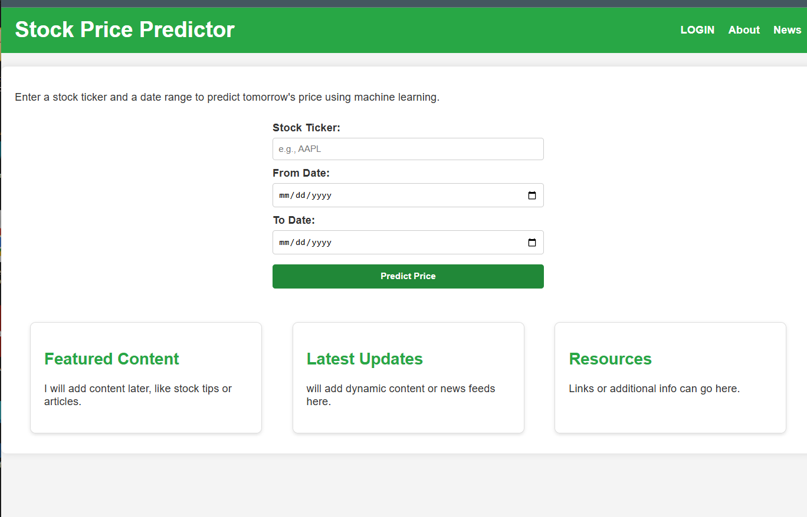
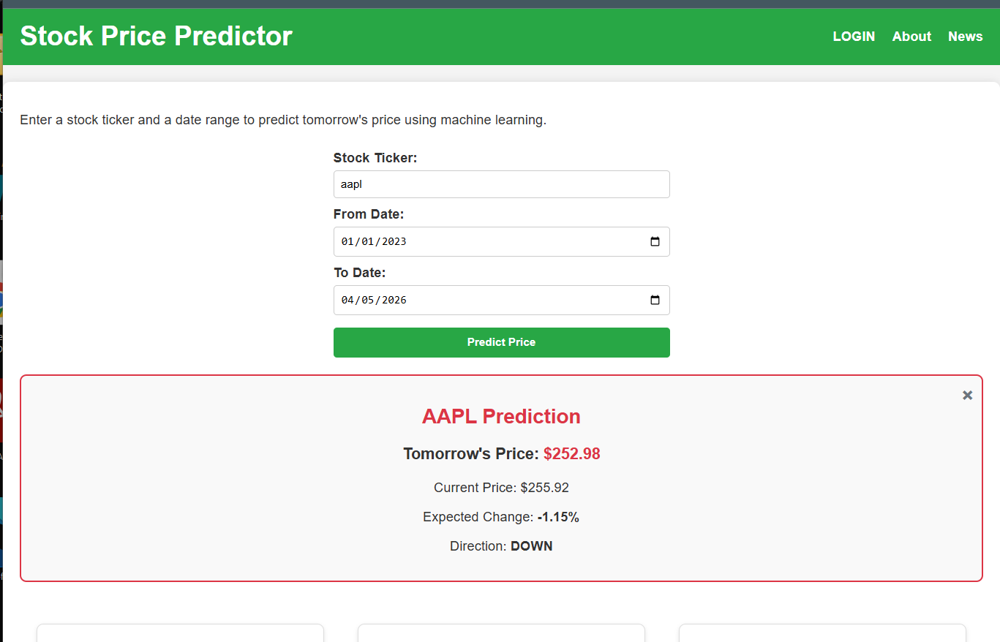

# Stock Prediction & Market Intelligence Platform

**FastAPI · Time Series · Machine Learning · Technical Indicators · Docker**

A full-stack web application that fetches historical time-series stock/crypto data, calculates technical indicators, and uses neural network ensembles to predict **tomorrow's price** and **direction** with confidence.

**Live Demo**: [Add your deployed URL here once ready]  
**Docker Hub**: https://hub.docker.com/r/dennis2026/stock-prediction-app  
**GitHub**: https://github.com/dself-dev/stock_prediction

### Screenshots

Here’s how the application looks:


*Main prediction interface – Enter ticker and date range*


*Example prediction for AAPL showing tomorrow’s price, expected change, and direction*

(Replace the file paths above with your actual screenshot file names after you add them to a `screenshots/` folder in your repo)

### ✨ Key Features
- Next-day price prediction using linear + nonlinear ensemble
- Direction classification (UP/DOWN) with confidence score
- LSTM-based time series modeling (**in progress**)
- Custom date range historical data via yfinance
- Modular technical indicator engine (RSI, Bollinger Bands, MACD, EMA, etc.)
- User authentication (register + login)
- Fully Dockerized deployment

### 🛠 Tech Stack
- **Backend**: FastAPI + Pydantic
- **ML**: TensorFlow/Keras (Dense, MLP, LSTM)
- **Data**: pandas, yfinance
- **Frontend**: Vanilla HTML, CSS, JavaScript
- **Deployment**: Docker
- **Database**: SQLite (authentication)

### 🚀 Quick Start

```bash
git clone https://github.com/dself-dev/stock_prediction.git
cd stock_prediction

# Local run
python -m venv venv
source venv/bin/activate          # Windows: venv\Scripts\activate
pip install -r requirements.txt
uvicorn api.app:app --reload
Open → http://127.0.0.1:8000
Docker:
Bashdocker build -t stock-prediction .
docker run -p 8000:8000 stock-prediction
📊 How It Works
Fetches time-series market data → engineers technical indicators → trains specialized models per ticker → returns price prediction + direction confidence.
Note: Models currently train on-the-fly (research/demo phase). Model persistence is planned.
Disclaimer: Educational & research use only. Not financial advice.